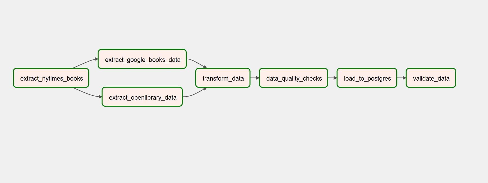
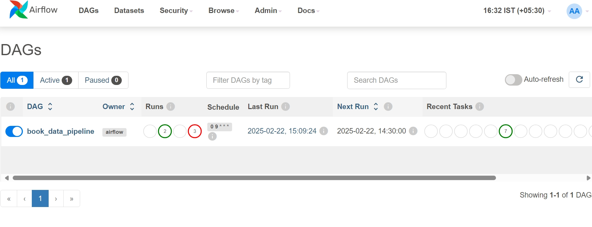
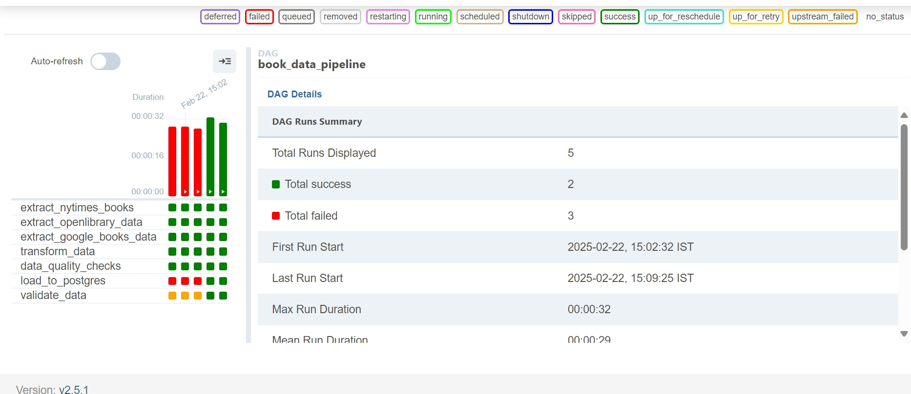
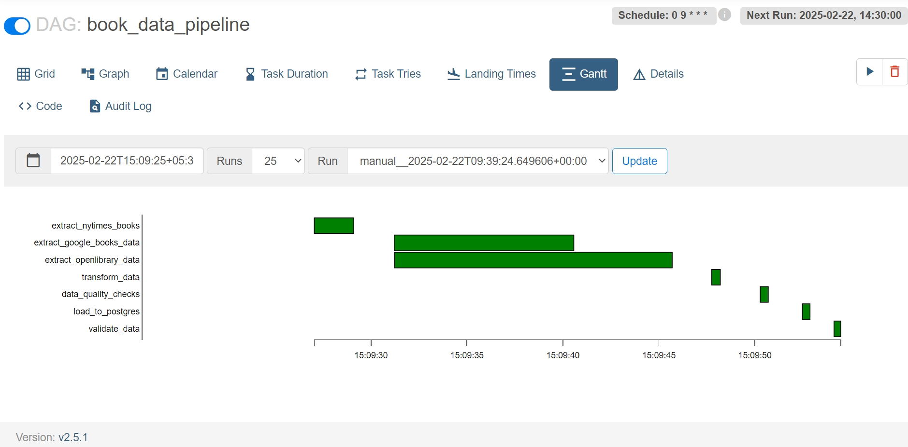

# 📚 Book Data Pipeline

A fully automated **book data pipeline** using **Apache Airflow**, integrated with APIs (**NYT, OpenLibrary, Google Books**) and storing results in **PostgreSQL**.

---

## 📌 Project Overview & Architecture Diagram

This project automates book data extraction, validation, and storage using **ETL** principles. Below is the architecture diagram:



```
airflow-book-data-pipeline
|docker-compose.yaml
+---dags
|   |   book_pipeline.py
|   \---data
|   
+---logs
```

The pipeline consists of the following stages:

1. **Data Extraction:**

   - **fetch\_nytimes\_books():** Fetches the bestseller list from the New York Times Books API and stores the JSON response in `dags/data/nyt_books.json`.
   - **fetch\_openlibrary\_data():** Reads the NYT data, extracts ISBNs, and retrieves additional metadata (e.g., cover images, subjects) from the Open Library API, saving the output to `dags/data/openlibrary_data.json`.
   - **fetch\_google\_books\_data():** Uses the list of ISBNs from the NYT data to query the Google Books API for detailed book information, storing the JSON response in `dags/data/google_books.json`.

2. **Data Transformation & Enrichment:**

   - **transform\_and\_enrich\_data():** Loads the JSON files from the extraction phase, merges and cleans the data, and then exports a unified CSV file (`dags/data/transformed_books.csv`). It integrates data from all sources (NYT, OpenLibrary, and Google Books) to match the final schema.

3. **Data Quality Inspection & Validation:**

   - **data\_quality\_checks():** Reads the transformed CSV file and performs checks for missing values, duplicate records, and other anomalies. It generates a data quality report saved as `dags/data/data_validation_report.txt`.

4. **Data Loading:**

   - **load\_to\_postgres():** Reads the transformed CSV file, applies necessary data cleaning (e.g., converting `NaN` to `None`), and loads the data into a PostgreSQL database using batch inserts/upserts. The table schema is created (if not exists) to match the final required columns.

5. **Database Validation:**\
   Executes SQL queries on the PostgreSQL database to validate the loaded data. It checks the total record count, missing critical fields, duplicate ISBNs, invalid ISBN formats, and other quality metrics. The results are written to a validation report file.

---

## 🔑 How to Get API Keys

### 📖 Google Books API Key

1. Go to [Google Cloud Console](https://console.cloud.google.com/).
2. Create a new project or select an existing one.
3. Navigate to **APIs & Services > Library**.
4. Search for **Google Books API** and enable it.
5. Go to **APIs & Services > Credentials**.
6. Click **Create Credentials** → **API Key**.
7. Copy the generated API Key.

### 📰 New York Times (NYT) API Key

1. Visit [NYT Developer Portal](https://developer.nytimes.com/).
2. Sign in or create a free account.
3. Click on **Get Started** and create a new App.
4. Select **Books API** and request an API key.
5. Copy the generated API Key.

---

## 🔧 Installation & Setup

### 1️⃣ Install Docker Desktop

This project runs inside Docker containers. **Install Docker Desktop** before proceeding:

- [Download Docker](https://www.docker.com/products/docker-desktop)
- Follow the installation instructions for your OS.

### 2️⃣ Clone the Repository

```bash
git clone https://github.com/SHOAIB2110/airflow-book-data-pipeline.git
cd airflow-book-data-pipeline
```

### 3️⃣ Set Up Environment Variables

Before running the pipeline, export the API keys :

```bash
export  NYT_API_KEY= your-nyt-api-key
export GOOGLE_BOOKS_API_KEY= your-google-api-key
```

✅ **Verify Environment Variables:**

```bash
echo $API_KEY_NYT
echo $API_KEY_GOOGLE
```

### 4️⃣ Install Dependencies (Optional for Local Execution)

Create a **virtual environment** and install dependencies:

```bash
python3 -m venv venv
source venv/bin/activate  # Mac/Linux
venv\Scripts\activate     # Windows
pip install -r requirements.txt
```

---

## 🚀 Running the Pipeline with Docker

### 1️⃣ Build and Start Containers

```bash
docker-compose up -d
```

### 2️⃣ Check Running Containers

```bash
docker ps
```

---

## 🌐 Access Airflow UI


### 🔑 Default Credentials

- **URL:** [http://localhost:8080](http://localhost:8080)
- **Username:** `airflow`
- **Password:** `airflow`

👉 *Once inside Airflow, navigate to **********`book_data_pipeline`********** and trigger the DAG.*







---

## 📊 Database Inspection

### **Checking Database for Data Completeness & Quality**

To ensure data completeness and quality, first, access the **PostgreSQL** database inside the running Docker container:

```bash
docker exec -it airflow-book-data-pipeline-postgres-1 psql -U airflow -d airflow
```

Once inside the **PostgreSQL shell**, run the following queries to check the data:

```sql
SELECT * FROM books LIMIT 10;
SELECT COUNT(*) FROM books WHERE title IS NULL;
```

These queries will help verify that the data has been correctly ingested and stored. 🚀📊

---

## 🛠 Debugging & Logs

### 1️⃣ Check Airflow Logs

All logs for each task will be stored inside the **logs/** folder.

```bash
docker logs -f airflow-book-data-pipeline-airflow-scheduler-1
```
---

## 📄 Reports & Outputs

All generated reports, including data validation reports and quality checks, will be stored inside the **dags/** folder.

- **Data Quality Report:** `dags/data/data_validation_report.txt`
- **Transformed Data File:** `dags/data/transformed_books.csv`


---

